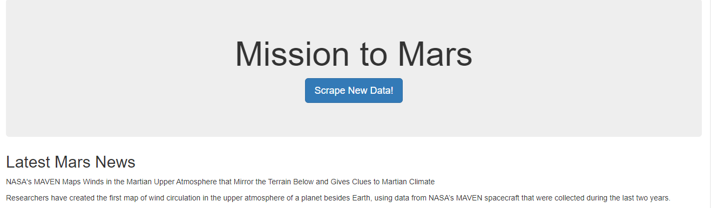
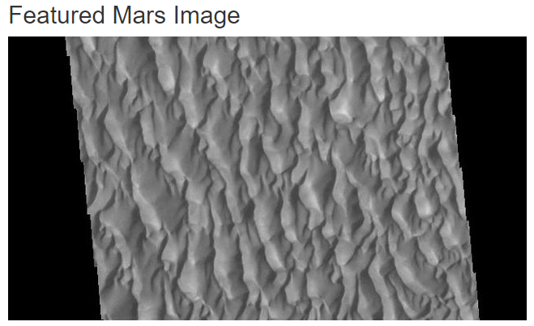
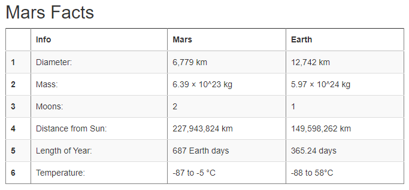
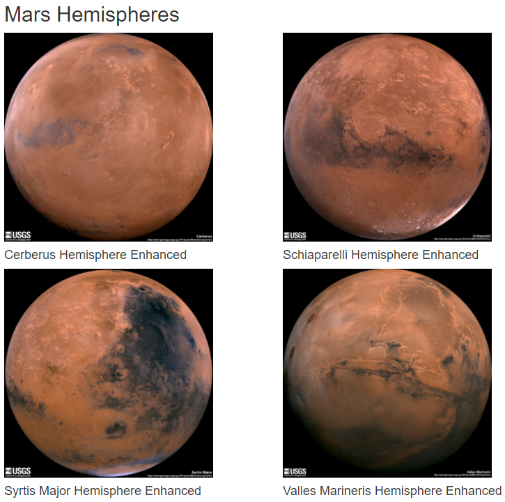
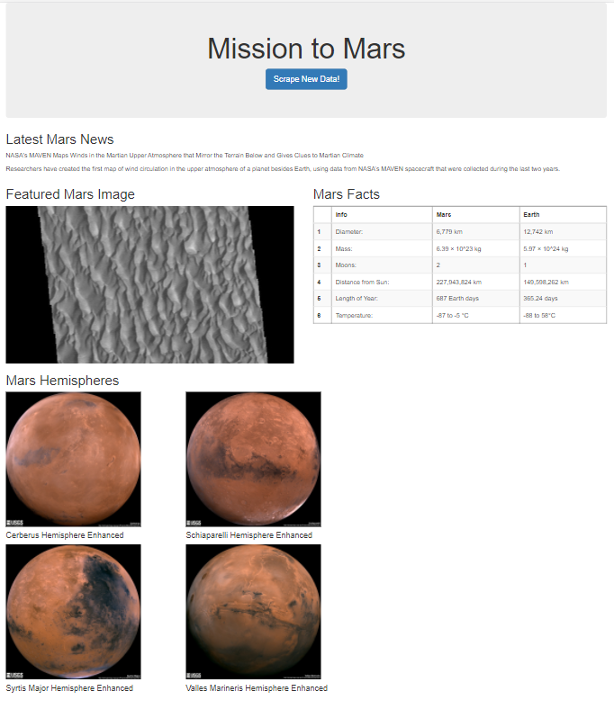

# web-scraping-challenge - Mission to Mars
Week 12 - web-scraping-challenge


In this assignment, I built a web application that scrapes various websites for data related to a Mission to Mars which displays the information in a single HTML page. The following outlines the steps executed to complete.

## Assignment structure
```
Web-Scraping-Challenge
|__ .gitignore                           # Gitignore file
|__ README.md                            # Markdown README
|  |__ images/                           # png screenshots
|       |__ featured_image.PNG           # png
|       |__ html_page.PNG                # png
|       |__ mars_facts.PNG               # png
|       |__ mars_hemispheres.PNG         # png
|       |__ mission_to_mars.png          # png
|       |__ nasa_mars_news.PNG           # png
|__ Mission_to_Mars/                     # Main directory
|    |__ static/                         # Static directory
|        |__ css/                        # CSS directory
|            |__ style.css               # Style.css file
|    |__ templates/                      # Template directory
|        |__ index.html                  # HTML
|__ .app.py                              # Flask
|__ .mission_to_mars.ipynb               # Jupyter notebook
|__ .scrape_mars.py                      # Python file

```


## Usage

```
Jupyter Notebook

* import pandas as pd
* import pymongo
* import requests
* import os
* import time
* from splinter import Browser
* from bs4 import BeautifulSoup as bs
* from webdriver_manager.chrome import ChromeDriverManager

Flask

* from flask import Flask, render_template, redirect
* from flask_pymongo import PyMongo
* import scrape_mars

HTML

* <!DOCTYPE html>
* <html lang="en">

```

## Datasets 

|No|Source|Link|
|-|-|-|
|1|mission_to_mars.ipynb|https://github.com/alysnow/web-scraping-challenge/blob/main/Missions_to_Mars/mission_to_mars.ipynb|
|2|scrape_mars.py|https://github.com/alysnow/web-scraping-challenge/blob/main/Missions_to_Mars/scrape_mars.py|
|3|app.py|https://github.com/alysnow/web-scraping-challenge/blob/main/Missions_to_Mars/app.py|
|4|style.css|https://github.com/alysnow/web-scraping-challenge/blob/main/Missions_to_Mars/templates/style.css|
|5|index.html|https://github.com/alysnow/web-scraping-challenge/blob/main/Missions_to_Mars/templates/index.html|


## Part 1 - Scraping

Initial scraping completed using Jupyter Notebook, BeautifulSoup, Pandas, and Requests/Splinter.

 * Jupyter Notebook file called mission_to_mars.ipynb to complete all scraping and analysis tasks. The following outlines what was scraped.


### NASA Mars News

 * Scraped the [Mars News Site](https://redplanetscience.com) and collected the latest News Title and Paragraph Text.
 



### JPL Mars Space Images - Featured Image

 * Visited the url for the Featured Space Image page [here](https://spaceimages-mars.com). Scraped the JPL Featured Space Image here. Used splinter to navigate the site to find the image url for the current Featured Mars Image.




### Mars Facts

 * Scraped the Mars Facts webpage [here](https://galaxyfacts-mars.com) and use Pandas to scrape the table containing facts about the planet including Diameter, Mass, etc. Use Pandas to convert the data to a HTML table string.




### Mars Hemispheres

 * Visit the Astrogeology site [here](https://marshemispheres.com) to obtain high resolution images for each of Mar's hemispheres.
 



## MongoDB and Flask Application

Use MongoDB with Flask templating to create a new HTML page that displays all of the information that was scraped from the URLs above.

 * Start by converting your Jupyter notebook into a Python script called scrape_mars.py with a function called scrape that will execute all of your scraping code from above and return one Python dictionary containing all of the scraped data.

 * Next, create a route called /scrape that will import your scrape_mars.py script and call your scrape function.

 * Store the return value in Mongo as a Python dictionary.

 * Create a root route / that will query your Mongo database and pass the mars data into an HTML template to display the data.

 * Create a template HTML file called index.html that will take the mars data dictionary and display all of the data in the appropriate HTML elements. Use the following as a guide for what the final product should look like, but feel free to create your own design.




## Contributor
- [Alysha Snowden](https://github.com/alysnow)


